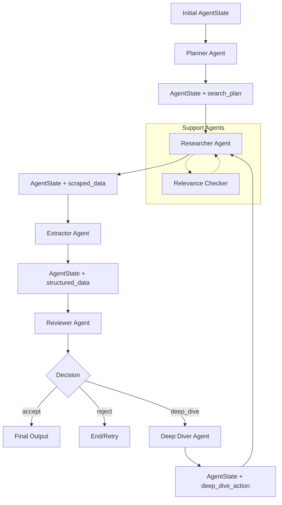

# Agent System Overview

This document provides a comprehensive overview of all agents in the GHGI (Greenhouse Gas Inventory) data discovery system, focusing on their input/output data types and data flow.

## System Architecture

The agent system follows a sequential workflow where each agent processes and enriches an `AgentState` object that flows through the pipeline:

```
Planner → Researcher → Extractor → Reviewer → [Deep Diver] → Final Output
```

## Core Data Types

### AgentState

The central data structure that flows between all agents:

```python
@dataclass
class AgentState:
    # Core identification
    target_country: Optional[str]
    target_country_locode: Optional[str]
    target_sector: Optional[str]
    target_city: Optional[str]  # For city-specific research

    # Search planning
    search_plan: List[Dict[str, Any]]  # List of SearchQuery objects

    # Data collection
    scraped_data: List[Dict[str, Any]]  # Raw scraped content
    structured_data: List[Dict[str, Any]]  # Extracted structured data
    urls: List[str]  # Collected URLs

    # Process tracking
    current_iteration: int
    decision_log: List[Dict[str, Any]]
    consecutive_deep_dive_count: int
    current_deep_dive_actions_count: int

    # Metadata
    metadata: Dict[str, Any]
    confidence_scores: Dict[str, float]
    start_time: str
```

### Key Schema Types

#### SearchQuery

```python
class SearchQuery(BaseModel):
    query: str  # The search query string
    language: str  # ISO 639-1 language code
    priority: str  # "high", "medium", "low"
    rank: int  # Numerical ranking for execution order
    target_type: str  # Type of target document
    status: str  # "pending", "searched", "completed"
```

#### StructuredDataItem

```python
class StructuredDataItem(BaseModel):
    name: str
    url: str
    method_of_access: str
    sector: Optional[str]
    subsector: Optional[str]
    data_format: Optional[str]
    description: Optional[str]
    granularity: str
    country: str
    country_locode: str
```

## Agent Details

### 1. Planner Agent

**File**: `agents/planner.py`

**Purpose**: Generates structured search plans based on target country and sector

**Input Data Types**:

- `AgentState` with:
  - `target_country: str`
  - `target_sector: str`
  - `target_city: Optional[str]` (for city mode)
  - `metadata.research_mode: str` ("country" or "city")
  - `metadata.english_only_mode: bool`

**Output Data Types**:

- `AgentState` with populated:
  - `search_plan: List[SearchQuery]` - 5-15 structured search queries
  - `target_country_locode: str` - UN LOCODE if identified
  - `metadata.primary_languages: List[str]`
  - `metadata.key_institutions: List[str]`
  - `metadata.international_sources: List[str]`
  - `metadata.document_types: List[str]`
  - `current_iteration: int` (incremented)

**Process Flow**:

1. Load sector/city-specific prompt templates from `prompts/` directory
2. Send thinking prompt to `THINKING_MODEL` for analysis
3. Extract structured JSON using `STRUCTURED_MODEL`
4. Validate against `SearchPlanSchema`
5. Populate search plan with ranked queries

**Key Features**:

- Multi-language support (English + local language queries)
- City vs country mode selection
- Sector-specific prompt templates
- Structured LLM output with retry logic

---

### 2. Researcher Agent

**File**: `agents/researcher.py`

**Purpose**: Executes search plan, collects URLs, and scrapes content

**Input Data Types**:

- `AgentState` with:
  - `search_plan: List[SearchQuery]` (status="pending")
  - `target_country: str`
  - `target_sector: str`
  - `metadata.deep_dive_action: Optional[Dict]` (for deep dive requests)

**Output Data Types**:

- `AgentState` with:
  - `scraped_data: List[Dict]` - Raw scraped content with:
    ```python
    {
        "url": str,
        "title": str,
        "content": str,  # Markdown content
        "html_content": str,  # Original HTML
        "success": bool,
        "timestamp": str,
        "saved_html_filepath": Optional[str]
    }
    ```
  - `search_plan: List[SearchQuery]` (status updated to "searched")
  - `searches_conducted_count: int` (incremented)

**Process Flow**:

1. Process pending search queries (up to `MAX_QUERIES_PER_RESEARCH_CYCLE`)
2. Execute Google searches with filetype exclusions
3. Handle deep dive actions (scrape/crawl specific URLs)
4. Optional pre-scrape relevance filtering using `RelevanceChecker`
5. Scrape relevant URLs using `scrape_urls_async()`
6. Save HTML content to structured file system
7. Update AgentState with new scraped data

**Key Features**:

- Async Google search with quota management
- Deep dive URL integration (scrape/crawl actions)
- Relevance pre-filtering to reduce noise
- Structured file saving for HTML content
- Duplicate URL detection and handling

---

### 3. Extractor Agent

**File**: `agents/extractor.py`

**Purpose**: Converts raw scraped content into structured GHGI datasets

**Input Data Types**:

- `AgentState` with:
  - `scraped_data: List[Dict]` - Raw content from Researcher
  - `target_country: str`
  - `target_country_locode: str`

**Output Data Types**:

- `AgentState` with:
  - `structured_data: List[StructuredDataItem]` - Extracted structured records:
    ```python
    {
        "name": str,  # Dataset name
        "url": str,   # Source URL
        "method_of_access": str,  # How to access data
        "sector": str,  # GHGI sector (Energy, IPPU, AFOLU, Waste)
        "subsector": Optional[str],
        "data_format": str,  # PDF, Excel, CSV, etc.
        "description": str,  # Dataset description
        "granularity": str,  # Geographic specificity
        "country": str,
        "country_locode": str
    }
    ```
  - `selected_for_extraction: []` (cleared after processing)

**Process Flow**:

1. Filter out already processed URLs
2. Skip file/document URLs requiring advanced scraping
3. For each document:
   - Load GHGI sectors context from `knowledge_base/ghgi_sectors.md`
   - Create extraction prompt with document content
   - Use `STRUCTURED_MODEL` with `json_schema` mode
   - Validate against `ExtractorOutputSchema`
   - Add fixed fields (URL, country, locode)
4. Update structured_data list

**Key Features**:

- LLM-based extraction with structured output
- GHGI sector classification using knowledge base
- Content truncation for large documents (7000 chars)
- Pydantic validation for data consistency
- Fallback to json_object mode if schema mode fails

---

### 4. Reviewer Agent

**File**: `agents/reviewer.py`

**Purpose**: Assesses quality of structured data and decides next actions

**Input Data Types**:

- `AgentState` with:
  - `structured_data: List[StructuredDataItem]`
  - `target_country: str`
  - `target_country_locode: str`
  - `search_plan: List[SearchQuery]` (for context)

**Output Data Types**:

- `AgentState` with:
  - `metadata.reviewer_decision: str` ("accept", "reject", "deep_dive")
  - `metadata.refinement_details: Optional[str]` (for deep dive)
  - `metadata.reviewer_assessment: Dict` - Detailed assessment:
    ```python
    {
        "relevance_score": str,  # "High", "Medium", "Low"
        "credibility_score": str,
        "completeness_score": str,
        "overall_confidence": str,
        "suggested_action": str,
        "action_reasoning": str,
        "refinement_details": Optional[str]
    }
    ```

**Process Flow**:

1. **Raw Review** (if enabled):
   - Send scraped documents to LLM for initial filtering
   - Get list of promising URLs for extraction
2. **Structured Review**:
   - Format structured data and context for LLM review
   - Use thinking model for analysis, structured model for JSON extraction
   - Assess relevance, credibility, completeness
   - Decide: accept, reject, or request deep dive
3. Handle consecutive deep dive limits and final decisions

**Key Features**:

- Two-stage review process (raw + structured)
- Configurable deep dive limits
- Structured assessment scoring
- Retry logic with tenacity
- Deep dive cycle management

---

### 5. Deep Diver Agent

**File**: `agents/deep_diver.py`

**Purpose**: Performs targeted exploration of promising websites

**Input Data Types**:

- `AgentState` with:
  - `metadata.refinement_details: str` - Specific request from reviewer
  - `scraped_data: List[Dict]` - To extract current websites
  - `structured_data: List[Dict]` - To extract current websites
  - `target_country: str`

**Output Data Types**:

- `AgentState` with:
  - `metadata.deep_dive_action: DeepDiveAction`:
    ```python
    {
        "action_type": str,  # "scrape", "crawl", "terminate_deep_dive"
        "target": Optional[str],  # URL for scrape/crawl
        "justification": str,
        "max_pages": Optional[int],  # For crawl (max 50)
        "exclude_patterns": Optional[List[str]]  # For crawl
    }
    ```
  - `consecutive_deep_dive_count: int` (incremented)
  - `current_deep_dive_actions_count: int` (incremented for actions)

**Process Flow**:

1. Check action budget (`MAX_ACTIONS_PER_DEEP_DIVE_CYCLE`)
2. Extract current website domains from scraped/structured data
3. Send refinement request to `THINKING_MODEL` for analysis
4. Use `STRUCTURED_MODEL` to extract structured decision
5. Validate action type and parameters
6. Update counters and decision log

**Key Features**:

- Budget-limited deep dive cycles
- Website-focused exploration (same domain)
- Three action types: scrape, crawl, terminate
- Safety limits on crawl parameters
- Structured decision making with retry logic

---

### 6. Relevance Checker

**File**: `agents/relevance_checker.py`

**Purpose**: Filters search results before scraping to reduce noise

**Input Data Types**:

- `search_result: Dict[str, Any]`:
  ```python
  {
      "url": str,
      "title": str,
      "snippet": str
  }
  ```
- `target_country: str`
- `target_sector: str`
- `client: AsyncOpenAI`

**Output Data Types**:

- `RelevanceCheckOutput`:
  ```python
  {
      "is_relevant": bool,
      "reason": str  # Explanation for decision
  }
  ```

**Process Flow**:

1. Load relevance check prompt template
2. Format prompt with search result details
3. Send to `RELEVANCE_CHECK_MODEL` with JSON schema
4. Parse structured response
5. Return relevance decision with reasoning

**Key Features**:

- Async operation for batch processing
- Structured JSON output
- Context-aware relevance assessment
- Error handling with fallback decisions

---

## Data Flow Diagram



## Configuration and Limits

### Key Configuration Parameters

- `MAX_QUERIES_PER_RESEARCH_CYCLE`: 5
- `MAX_RESULTS_PER_QUERY`: 10
- `MAX_ACTIONS_PER_DEEP_DIVE_CYCLE`: 3
- `MAX_CONSECUTIVE_DEEP_DIVES`: 2
- `ENABLE_PRE_SCRAPE_RELEVANCE_CHECK`: true

### Model Usage

- `THINKING_MODEL`: Complex analysis and reasoning
- `STRUCTURED_MODEL`: JSON extraction and validation
- `RELEVANCE_CHECK_MODEL`: URL relevance filtering

### File System Organization

```
logs/
├── planner_outputs/          # LLM outputs from planner
├── search_api_outputs/       # Raw search results
├── researcher_outputs/       # Research cycle summaries
└── scraped_content/          # HTML content by country/sector/run
    └── {country}/
        └── {sector}/
            └── {run_id}/
                └── *.html
```

## Error Handling

All agents implement robust error handling:

- **Retry Logic**: Using tenacity for LLM calls and network operations
- **Fallback Modes**: JSON object mode when JSON schema fails
- **Validation**: Pydantic models for all structured data
- **Graceful Degradation**: Agents continue with partial data on errors
- **Comprehensive Logging**: All decisions and errors are logged

## Summary

This agent system provides a robust pipeline for discovering and structuring GHGI data:

1. **Planner** creates targeted search strategies
2. **Researcher** executes searches and collects raw content
3. **Extractor** converts content to structured datasets
4. **Reviewer** assesses quality and guides next steps
5. **Deep Diver** performs focused exploration when needed
6. **Relevance Checker** filters noise throughout the process

The system handles multiple languages, different geographic scopes (country/city), and various GHGI sectors while maintaining data quality and traceability through comprehensive logging and validation.
